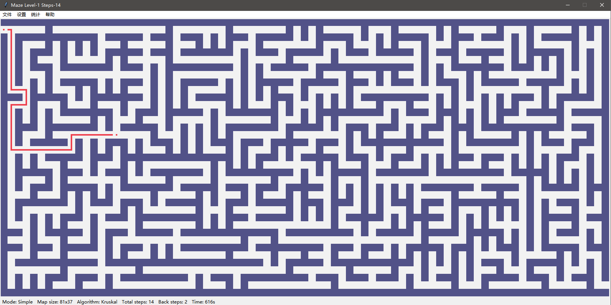
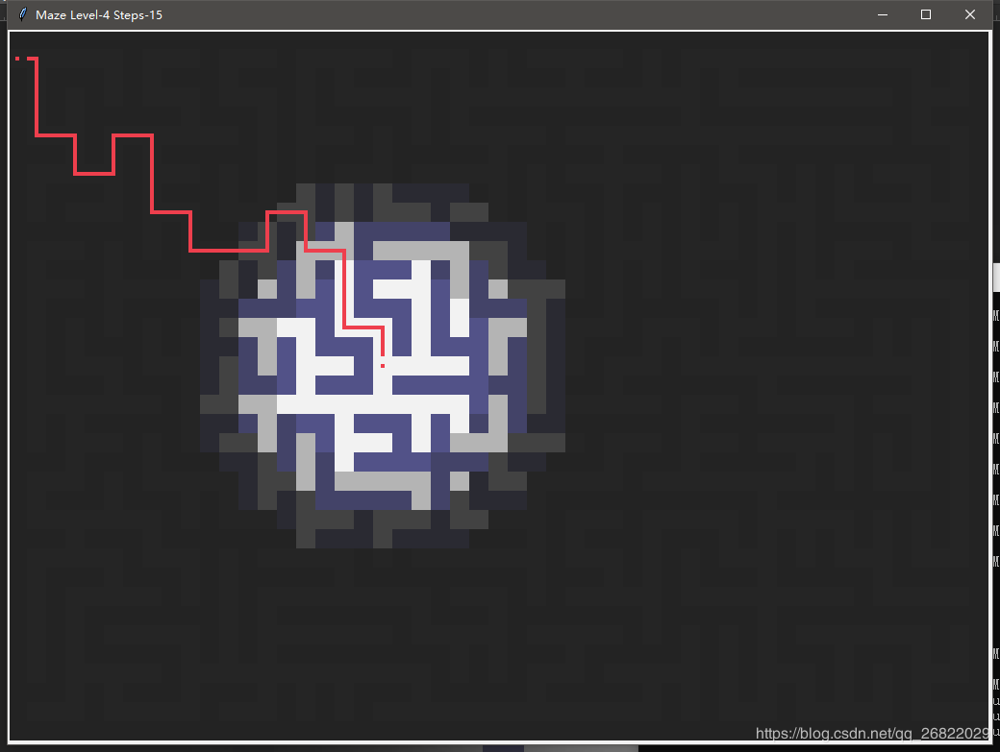

# Maze-Game

current-version:  ***v1.0.7***

简单模式截图：



迷雾模式截图：




## Requirements

- `Python3`
- `Pandas`
- `Numpy`
- ~~`Seaborn`~~
- ~~`matplotlib`~~


## Download & Installation

### 1 Download

#### Git

使用Git克隆当前项目到本地：

```
git clone https://github.com/wonanut/Maze-Game.git
```

#### Download

直接下载当前项目到本地后解压


### 2 Installation

进入根目录：

```
cd Maze-Game-Maze-game-v1.0.7
```

在确保安装了上述python库之后，执行命令

```python
python Maze.py
```

如果执行上述命令不能打开且没有报错，多尝试几次即可。


## Log files

程序将会在根目录自动生成日志文件 `./maze_game.log` 


### TODO lists

- 游戏背景音乐以及交互音乐
- 添加更人性化的显示界面
- 完善历史数据展示功能
- 进一步修改为2.5D或者3D，拟使用Unity开发
- 添加闯关模式，将当前模式设置为休闲模式
- 添加生存模式，参考[Roguelike Vision Algorithms](http://www.adammil.net/blog/v125_Roguelike_Vision_Algorithms.html)丰富可玩性
- 完善当前迷雾模式，添加视野以及奖励
- 开发Android版


### Update information

- 2020-02-04 ***v1.0.7*** 添加功能：
  1. 添加保存、读取地图功能
  2. 添加快捷键操作
  3. 进一步完善编辑菜单功能，添加 回到起点，换个地图等功能
  4. 添加日志功能，目前暂时不支持统计结果展示功能
  5. 添加地图大小选择功能，目前支持三种尺寸地图：31x31, 41x41, 81x37
  6. 添加自动前进到下一个路口功能开关，默认开
  7. 添加简单模式和迷雾模式切换开关，默认简单模式
  8. 完善底部状态栏


- 2020-02-02 ***v1.0.5*** 版本上传，基础功能有
  1. 增加状态栏显示状态信息
  2. 作弊（查看提示）增加惩罚分数(当前作弊一次惩罚20分)
  3. 菜单栏，可用于设置地图生成算法，地图尺寸等（待完善）
  4. 增加迷雾模式
  5. 显示等级以及当前移动步数
  6. 随机生成游戏地图
  7. 按方向键后自动前进倒退（到分岔路停止）  
  8. 起点到任意位置辅助路径显示（鼠标左键单击空白地方显示路线）  移动次数计数 
  9. 到达终点后通关，按任意键进入下一关（目前没有难度设置，难度相同）


## Developer

Howard Wonanut：wonanut@foxmail.com
